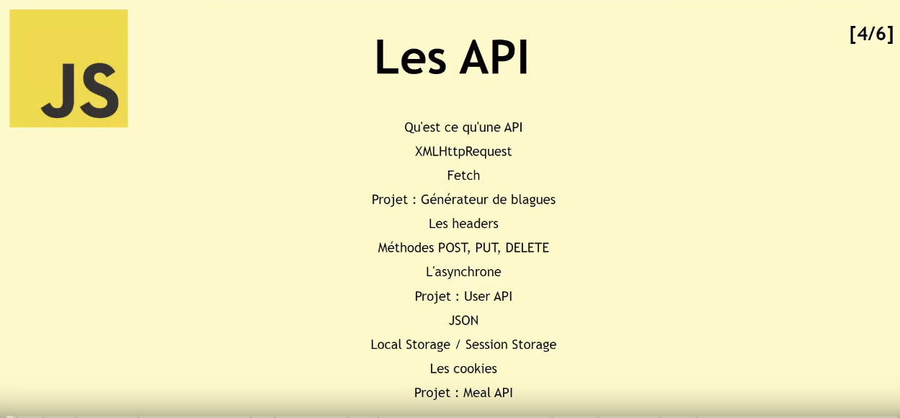

# user-app
 
# [Cours Javascript] Apprendre Javascript de A à Z – Les API (4/6)

## From Scratch - Développement Web

( [VIDEO](https://youtu.be/Xm9i87uliU8) )

**Timecodes**

- [x] 0:00 - Intro
- [x] 1:58 - Qu'est ce qu'une API
- [x] 7:30 - XMLHttpRequest
- [x] 14:16 - Fetch
- [x] 27:22 - Projet : Générateur de blagues
- [x] 51:25 - Les options de requête
- [x] 56:16 - Méthodes POST, PUT, DELETE
- [x] 1:11:58 - L'asynchrone
- [x] 1:18:10 - Projet - Api User
- [x] 1:55:18 - Le JSON
- [x] 2:05:06 - Local Storage / Session Storage
- [x] 2:18:07 - Les cookies
- [x] 2:25:43 - Projet - Cooking App

